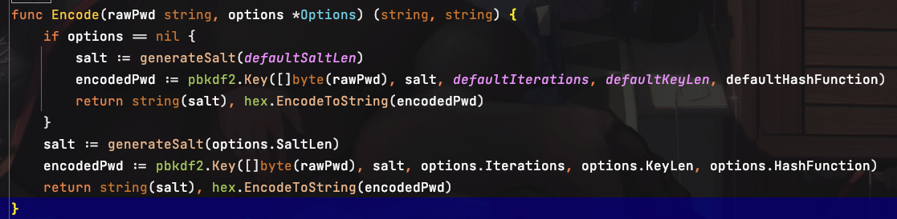

# open-gin-shop 后端开发

##### [ 笔者水平有限，希望玩的开心😝 ]

# 准备阶段

- consul：

~~~dockerfile
docker pull consul:latest

docker run -d -p 8500:8500 -e CONSUL_BIND_INTERFACE='eth0' --name=consul consul agent -server -bootstrap -ui -client='0.0.0.0'
~~~

- nacos：

~~~dockerfile
docker run --name nacos -e MODE=standalone -e JVM_XMS=512m -e JVM_XMX=512m -e JVM_XMN=256m -p 8848:8848 -d nacos/nacos-server:latest
~~~

- elasticsearch：

~~~dockerfile
docker run --name elasticsearch -d -e ES_JAVA_OPTS="-Xms512m -Xmx512m" -e "discovery.type=single-node" -p 9200:9200 -p 9300:9300 elasticsearch:7.7.0
~~~

- kibana：

~~~dockerfile
# 版本 尽量和 elasticsearch 一致
docker pull kibana:7.7.0

docker run -d --name kibana --link elasticsearch:elasticsearch -e "I18N_LOCALE=zh-CN" -p 5601:5601 kibana:7.7.0
~~~

- ik 分词器

~~~dockerfile
# 版本 尽量和 elasticsearch 一致
https://github.com/medcl/elasticsearch-analysis-ik/releases/tag/v7.7.0

# 加到 elasticsearch 中
docker cp elasticsearch-analysis-ik elasticsearch:/usr/share/elasticsearch/plugins
~~~

- jaeger

~~~dockerfile
docker run -d --name jaeger \
  -e COLLECTOR_ZIPKIN_HOST_PORT=:9411 \
  -e COLLECTOR_OTLP_ENABLED=true \
  -p 6831:6831/udp \
  -p 6832:6832/udp \
  -p 5778:5778 \
  -p 16686:16686 \
  -p 4317:4317 \
  -p 4318:4318 \
  -p 14250:14250 \
  -p 14268:14268 \
  -p 14269:14269 \
  -p 9411:9411 \
  jaegertracing/all-in-one:1.43
~~~

- Prometheus

~~~dockerfile
docker run -d --name prometheus-node1  -p 9090:9090  bitnami/prometheus:latest
~~~

# 功能清单

- goods-srv 商品相关
    - [x] 商品列表
    - [x] 商品详情
    - [x] 商品增删改查
    - [x] 多选批量拉取商品信息（如下单、购物车）
    - [x] 获取商品分类
    - [x] 获取子分类
    - [x] 分类增删改查
    - [x] 品牌信息列表
    - [x] 品牌增删改查
    - [x] 展示位轮播图列表
    - [x] 轮播图增删改查
    - [x] 分类下的品牌列表（如手机、生鲜、零食等分类对应的品牌）
    - [x] 根据分类列表拉取相应轮播广告图列表
    - [x] 品牌和分类绑定轮播图增删改查
- inventory-srv 库存相关
    - [x] 拉取相应商品的库存信息
    - [x] 库存增删改查
- order-srv 订单相关
    - [x] 拉取购物车列表（批量拉取商品信息）
    - [x] 购物车增删改查
    - [x] 创建订单
    - [x] 订单列表
    - [x] 订单详情
    - [x] 订单状态
- user-srv 用户相关
    - [x] 拉取用户列表
    - [x] 手机号查找用户
    - [x] ID查找用户
    - [x] 用户添加
    - [x] 用户更新信息（昵称、生日、性别）
    - [x] 用户登录注册
    - [x] 阿里云 oss文件上传
    - [x] 图形、短信、邮箱 验证码
- userop-srv 操作相关
    - [x] 地址列表
    - [x] 地址增删改查
    - [x] 拉取留言备注列表
    - [x] 添加留言
    - [x] 收藏列表
    - [x] 收藏增删改查

# 整体鸟撖图

# 一些实现上的想法和思考

~~~dockerfile
1、后端整体实现按照微服务的想法来构思

2、一些接口上实现可能比较简单

3、拿出来作为学习项目还需要打磨，先把所学先应用到实践，再学着去优化，接口上细思是有不足的 [滑稽😝]

4、使用到的技术栈：gin、gorm、Redis、MySQL、grpc、protobuf、Consul、Nacos、Rocketmq、elasticsearch、jaeger、Prometheus、sentinel
~~~

### goods-商品

- 在 web 端通过sentinel 控制限流

- 启动时加载商品列表到 ES预热

- 使用 elasticsearch 做商品快速的全文索引，提供关键字过滤、新品热销筛选、价格区间筛选、商品分类筛选

- 在修改数据的地方使用 gorm事务和钩子函数，保证数据库和 ES中的内容一致

- 商品分类有3级子分类，可以更灵活筛选商品

### user-用户

- 登录验证，使用图片验证码库 base64Captcha 验证爬虫，登录成功后返回 jwt-token
- 用户注册，首先是要从Redis取验证码对比，成功后验证密码
- 邮箱验证码发送和 oss对象存储 使用的阿里云测试
- 我这里存的密码格式有一点不一样，我是以（\$加密算法$随机盐值\$密文）存在数据库，这种方式感觉更灵活

### userop-用户操作

- 这部分实现比较简单，基本的增删改查

### order-订单 和 inventory-库存 (这部分最重要)

- 引用支付宝网页支付方式
- 这部分主要体现在分布式中，如何保证微服务之间相互远程调用还能够保证事务一致性
- 首先先说一下我的解决分布式事务的方案，我是使用 Rocketmq实现基于可靠消息的最终一致性

之前也是想过另外的几种方案，比如 2PC、TCC、分布式锁

- 2PC 的情景如下

~~~dockerfile
2PC 的实现简单，就是一个协调者去通知所有的参与者，二阶段确认他们的执行情况，当出现有执行失败的，协调者就会通知所有的参与者回滚这次操作

再仔细思考一下就会发现很大的缺陷，协调者需要等待所有的参与者返回确认信息，假如这个时候出现某个节点网路延迟或直接宕机，迟迟接收不到确认将持续阻塞

前面是参与者出错，假设是协调者在发送提交事务命令时出错，那么参与者的数据将不一致，宕机那整个事务无法处理
~~~

- TCC 的情景如下

~~~dockerfile
tcc 实现有一点复杂，需要在代码中增加Try、Confirm、Cancel三个方法，增加了开发维护难度

基于乐观锁来协调分布式事务，不用像 2PC一样阻塞等待，更高性能

一般 try成功了，confirm 也会成功，try失败了，则调用 cancel全部回滚

缺点也很明显了，如果要增加参与者就必须重新实现 TCC 3个方法，占用资源锁定时间太长，可能死锁，参与者串行执行，无法处理多个参与者的事务
~~~

- 还可以使用 Redlock、ZooKeeper 实现分布式锁

- 现在开始介绍我的解决方案，问个问题，当前场景下是先创建订单呢，还是先扣减库存呢

~~~dockerfile
先创建订单，故障时库存还未扣减，订单已经写入数据库

先扣减库存，故障时订单还未创建，库存已经减少

竟然要一起执行，首先想到的是引入 Rocketmq，通过 hash取模方式使同一个事务进入同一个队列，这个方法异步执行好像还行

但是缺点也很明显，假如增加参与者，就要重新计算hash取模，而且可能出现某些负载消息较大，有序性也不能保证
~~~

~~~dockerfile
我的想法是像购买火车票一样，提交订单时预先扣减库存，用一张表记录下来，10分钟内超时未支付、支付失败或者取消订单，都需要自动归还扣减给库存

通过向 rocketmq发送 half消息，保证本地事务和远程事务必须同时成功，且不能超时，任何一方失败都会执行提交 half rollback消息，保证了最终的一致性
~~~

